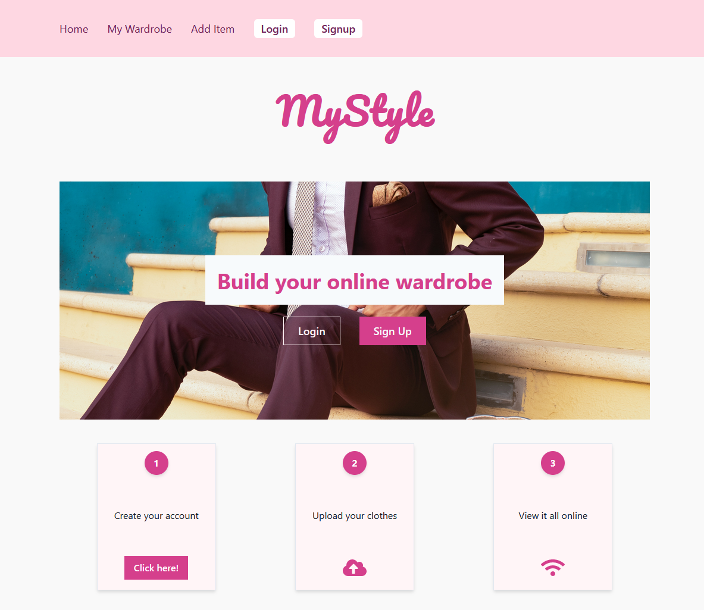
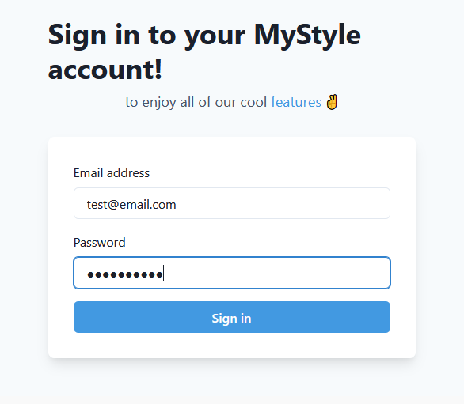
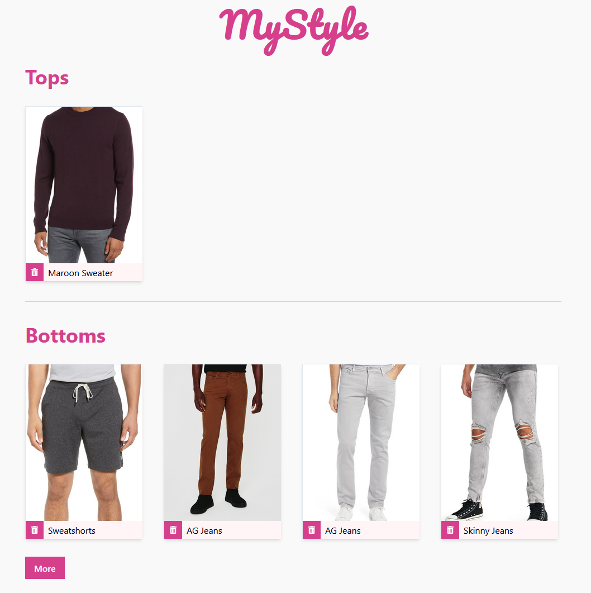
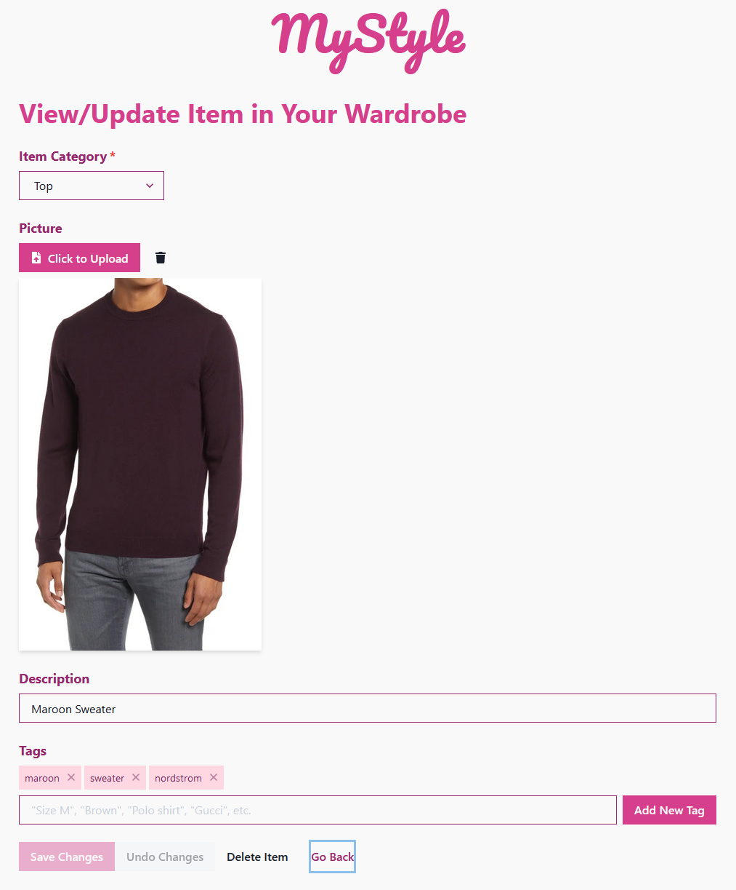

# MyStyle [](https://www.gnu.org/licenses/agpl-3.0)

## Description

A wardrobe management app on the MERN stack with Firebase + Chakra UI

## Contents

- [Installation](#installation)
- [Usage](#usage)
- [Questions](#questions)
- [License](#license)

## Installation

First, clone the project and install all the dependencies as follows:

```
git clone https://github.com/jcgasper/mystyle.git
cd mystyle
npm install
```

This app relies on MongoDB, which you can run locally or remotely. To use a remote MongoDB, create a `.env` file inside the root folder and add a line `MONGODB_URI=` followed by the URI for your database.

The app also relies on Firebase for image upload storage. You will need to make a Firestore app and enable storage. Then add the following lines to the `.env` file:

```
GOOGLE_TYPE=
GOOGLE_PROJECT_ID=
GOOGLE_PRIVATE_KEY_ID=
GOOGLE_PRIVATE_KEY=
GOOGLE_CLIENT_EMAIL=
GOOGLE_CLIENT_ID=
GOOGLE_AUTH_URI=
GOOGLE_TOKEN_URI=
GOOGLE_AUTH_PROVIDER_X509_CERT_URL=
GOOGLE_CLIENT_X509_CERT_URL=
```

These values come from your firebase account after you have created one. You will also have to add firebase credentials to the client.

Finally, you will have to add a secret used for signing tokens to the `.env` file with a line starting `SECRET=` followed by your secret text string.


## Usage

The app is currently online at [mystyle-wardrobe-manager.herokuapp.com](https://mystyle-wardrobe-manager.herokuapp.com/)



Users can log in or sign up for an account.



Once logged in, users will have a view of all of their clothes.



Users can add an article of clothing by clicking on the "Add Item" button in the top navbar.

At the Add Item page, you can select an item category, upload a photo, type in a description, or add any tags.

Once you have items in your profile, you can view or edit them by click on them from your profile page. You can copy the URL from your View Item page to share that page with a friend.




## Questions

If you have any questions, feel free to reach out via one of the following:

- Email:
  - [brian.baker.bdb@gmail.com](mailto:brian.baker.bdb@gmail.com)
  - [jacobgasper@gmail.com](mailto:jacobgasper@gmail.com)
  - [mdbow22@gmail.com](mdbow22@gmail.com)
- Github: 
  - @baker-ling
  - @mdbow22
  - @jcgasper

## License

This application is distributed under the terms of [GNU Affero General Public License v3.0](./LICENSE).
